<head>
    <script src="https://cdn.mathjax.org/mathjax/latest/MathJax.js?config=TeX-AMS-MML_HTMLorMML" type="text/javascript"></script>
    <script type="text/x-mathjax-config">
        MathJax.Hub.Config({
            tex2jax: {
            skipTags: ['script', 'noscript', 'style', 'textarea', 'pre'],
            inlineMath: [['$','$']]
            }
        });
    </script>
</head>

# 数据竞赛笔记

11812804 董正

---

## 1 竞赛框架

1. 问题理解，分析，规划

   * 数据的收集方式，脏数据
   * 标签
   * 评估指标
   * 基于赛事的重要时间点进行详细地规划，包括什么时候考虑做模型融合、组队的时间范围等

2. 数据探索分析

   * 数据的整体情况
   * 每个字段的含义
   * 异常值
   * 标签是否分布平衡
   * 特征字段与标签的关系
   * 训练集合与测试集合的数据分布是否存在较大的差异

3. 样本筛选、样本组织

   * 设计标签集合和特征集合，尽可能使用有价值的信息

4. 验证策略设计

   * 保证线上线下模型结果一致

5. 模型理解和选择

   * 梯度提升树模型

6. 特征工程

   * 通过人为筛选、人为构建组合特征让模型原本很难学好的东西可以更加轻易的学习从而拿到更好的效果

7. 模型训练、验证、测试

   * 调参
     * 暴利式的调参
     * 贪心的贝叶斯调参

8. 模型预测结果分析

   * 线下和线上出现了较大的不一致
     * 模型的验证策略有误
     * 特征出现穿越
     * 其他问题
   * 一致
     * 多分类：哪几个类进行会相互分错
     * 回归问题：预测最大的误差在哪里

9. 后处理

   * 一些特殊的问题的评估指标是难以直接优化的
   * 对最终的预测结果进行后处理
   * F1等指标的优化
   * 对结果进行某些加权或者分组加权的操作来修正模型的预测结果
   * 基于问题背景设计的后处理

10. 模型融合

    * AUC 问题

      对预测结果先进行 rank，然后对 rank 进行加权融合等

    * 回归类

      MSE 的优化和 MAE 的优化得到的结果进行融合

11. 复盘总结


---

## 2 赛题理解、分析与规划

### 2.1 赛题理解与分析

1. 问题背景理解

   * 时间复杂度需求
   * 内存需求

2. 数据收集形式的理解

   * 数据的采集方式
     * 人工收集
     * 机器采集
   * 特殊数据的处理
     * 明确什么代表空值（如 -1）
     * 还原一些删去的数据（匿名处理导致）
   * 打标的方式
     * 注意会不会有特殊的打标方式

3. 评测指标理解

   一般评测指标就是一个数学公式

   * 如果可以直接优化我们的评估指标，那么就直接用对应的优化函数对其进行优化
   * 如果不能直接对我们的损失函数进行优化，那么就考虑是否可以使用近似函数对其进行优化
   * 最后考虑能否使用一些后处理技巧对预测结果进行纠正，从而得到更好的结果

---

### 2.2 回归相关指标优化

1. RMSE (Root Mean Square Error)
   $$
   RMSE=\sqrt{\frac 1N\sum_{i=1}^N(y_i-\bar{y_i})^2}
   $$
   $N$: 样本个数

   $y_i$: 第 $i$ 个样本的真实值

   $\bar{y_i}$: 第 $i$ 个样本的预测值

   RMSE 是可以直接优化的函数，一般默认选用平方损失函数（L2 损失）进行优化

2. MSE (Mean Square Error)
   $$
   MSE=\frac 1N\sum_{i=1}^N(y_i-\bar{y_i})^2=RMSE^2
   $$
   又称 L2 损失:

   * 优点：便于梯度下降，误差大时下降快，误差小时下降慢，有利于函数收敛
   * 缺点：受明显偏离正常范围的离群样本的影响较大

3. MAE (Mean Absolute Error)
   $$
   MAE=\frac 1N\sum_{i=1}^N|y_i-\bar{y_i}|
   $$
   又称 L1 损失:

   * 优点：克服了 MSE 的缺点，受偏离正常范围的离群样本影响较小。
   * 缺点：收敛速度比 MSE 慢，因为当误差大或小时其都保持同等速度下降，而且在某一点处还不可导，计算机求导比较困难

4. RMSLE (Root Mean Squared Logarithmic Error)
   $$
   RMSLE=\sqrt{\frac 1N\sum_{i=1}^N(\log(y_i+1)-\log(\bar{y_i}+1))^2}
   $$
   先对数据做 log1p 转化，然后使用 L2 损失函数直接求解即可

   $log1p(x)=\ln(x+1)$

5. MAPE (Mean Absolute Percentage Error)
   $$
   MAPE=\frac 1N\sum_{i=1}^N\frac{|y_i-\bar{y_i}|}{|y_i|}
   $$
   如果采用神经网络对此类问题进行优化，可以直接自己定义 MAPE 的 loss

---

### 2.3 二分类相关指标优化

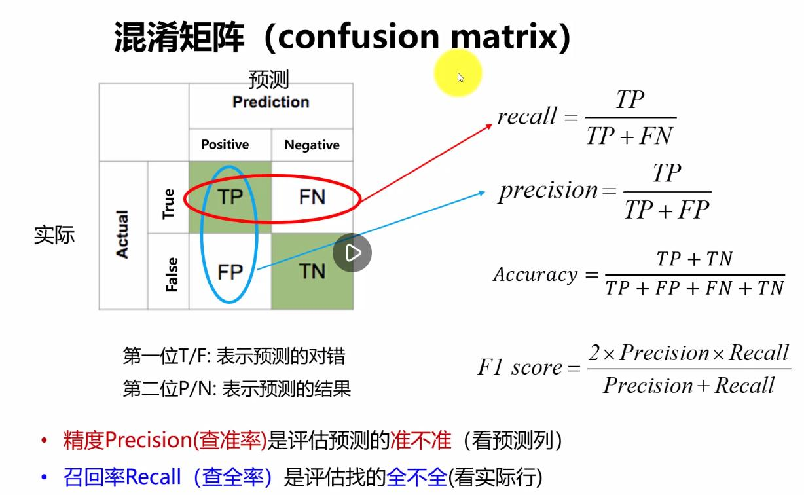

1. Accuracy
   $$
   acc=\frac 1N\sum_{i=1}^NI(y_i=\bar{y_i})
   $$
   $N$: 测试样本的个数

   $y_i\in\{0, 1\}$: 样本 $i$ 的标签

   $\bar{y_i}\in\{0, 1\}$: 对样本 $i$ 的预测结果

   $I(x)=\begin{cases}1&x\ is\ true\cr0&x\ is\ false\end{cases}$

   优化: Binary Cross Entropy
   $$
   BCE=-\frac 1N\sum_{i=1}^N[y_i\log p_i+(1-y_i)\log(1-p_i)]
   $$

2. F1 Score

   F1 指标经常出现在一些类别不平衡的问题中，在之前的数据竞赛中，最为常见的就是交易欺诈，银行贷款逾期预估类的竞赛

   优化: BCE

   不同之处在于，在得到最终的预测概率之后，需要通过一些策略寻找最优阈值

   还有的时候会对损失函数进行加权优化，例如标签为 1 的样本的权重就设置大一些等

3. 交叉熵损失

4. ROCAUC

   AUC（Area Under Curve）被定义为 ROC 曲线下与坐标轴围成的面积，一般我们以 TPR 为 y 轴，以 FPR 为 x 轴，就可以得到 ROC 曲线。AUC 的数值都不会大于 1。又由于 ROC 曲线一般都处于 y=x 这条直线的上方，所以 AUC 的取值范围在 0.5 和 1 之间。AUC 越接近 1.0，检测方法真实性越高; 等于0.5 时，一般就无太多应用价值了
   $$
   FPR=\frac{FP}{TN+FP}\\ TPR=\frac{TP}{TP+FN}
   $$
   优化: BCE

5. Normalized Gini Coefficient

   $Gini=2AUC-1$

   优化: BCE

---

### 2.4 多分类相关指标优化

1. categorization accuracy
   $$
   acc=-\frac 1N\sum_{i=1}^NI(y_i=p_i)
   $$
   $N$: 测试样本个数

   $y_i$: 第 $i$ 个样本的标签

   $p_i$: 第 $i$ 个样本的预测类别

   为什么 accuracy 有负号？？？

   优化:
   $$
   loss=-\frac 1N\sum_{i=1}^n\sum_{j=1}^Ky_{i, k}\log p_{i, k}
   $$
   $y_{i, k}$: 第 $i$ 个样本标签为 $k$ 的情况，是则为 1，不是为 0

   $p_{i, k}$: 模型预测样本 $i$ 属于 $k$ 类的概率

2. MultiLogloss
   $$
   logloss=-\frac 1N\sum_{i=1}^N\sum_{j=1}^My_{i, j}\log p_{i, j}
   $$
   就是上面那个

3. MAP (Mean Average Precision)
   $$
   mAP=\frac{1}{|U|}\sum_{u=1}^{|U|}\frac{1}{\min(A, m)}\sum_{k=1}^{\min(n, A)}P(k)
   $$
   $|U|$: 用户个数

   $P(k)$: 在截止点 $k$ 处的 precision

   $n$: 预测物品的数量

   $M$: 给定用户购买物品的数量，若 $M=0$ 则精度为 0

   你倒是告诉我 A 和 m 是啥啊

   优化: `sigmoid_cross_entropy`

4. Mean F1

   $F1=2\frac{p\cdot r}{p+r}, p=\frac{TP}{TP+FP}, r=\frac{TP}{TP+FN}$

   优化: Mean Square Loss

5. Average Jaccard Index

   两个区域 $A$ 和 $B$ 的 Jaccard Index 可以表示为：
   $$
   Jaccard=\frac{TP}{TP+FP+FN}=\frac{A\cap B}{A\cup B}=\frac{|A\cap B|}{|A|+|B|-|A\cap B|}
   $$
   TP 表示 true positive 的面积，FP 表示 false positive 的面积，FN 表示 false negative 的面积

   优化: 基于Sigmoid的损失函数

---

### 2.5 数据竞赛规划

* 赛制了解

  1. 提交次数了解

     * 每天提交几次
     * 有没有限制总共提交几次

  2. 平台稳定性调研

  3. 是否可以组队，组队截止日期以及组队与提交次数是否关联

  4. 是否可以使用外部数据

     有的可以有的不行，看好规则

  5. 是否可以对数据进行过拟合

  6. AB 榜的情况

* 时间安排

  * 模型融合的时间

    建议留到最后一周进行

  * 组队的时间

    建议一般在竞赛结束前 7-10 天就开始寻找队友，过早的组队可能并不能带来非常大的帮助，除非是非常好的，确定一起好好做的朋友

* 资料收集

  1. 历史类似竞赛案例的方案整理
  2. 相关的论文资料
  3. 相关的博客，知乎等资料

---

## 3 数据探索分析

### 3.1 全局数据探索分析

1. 数据整体观测

   先对数据进行简单的观测，对数据有一个简单的了解

2. 数据类型概览

   清楚每个数据的类型

3. 数据大小概览

   每个字段的个数，以及数据集所占据的空间大小

   * 如果数据大小很大的话，是否需要租一个服务器或者是否需要尽快寻找一个有机器的队友
   * 如果测试数据集太小的话，那么可能就需要考虑是否继续参赛，因为可能会出现波动非常大的情况，最后完全在摸奖

   以上用 `df.info()` 就可以看

4. 数据整体缺失情况观测

   * 简单数值观测

     `df.isnull().sum(axis=0)`

   * 可视化观测

     数据集的缺失情况:

     ```python
     import missingno as msno  
     msno.matrix(df)
     ```

     

     整体缺失情况:
     
     ```python
     msno.bar(df)
     ```
     
     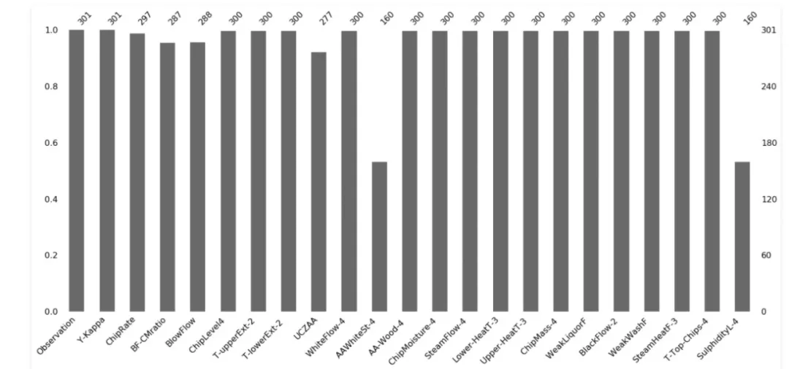

5. 字段 `nunique` 观测

   获取每个字段中不同的个数，可以直接对 `nunique` 为 1 的字段直接删除，因为这些字段是没有任何信息的

   ```python
   df.nunique()
   ```

---

### 3.2 单变量数据分析

1. 数值变量分析

   * 是否存在奇异值

   * 数据的整体分布情况

     

   1. 基于数值观察

      可以直接通过 `pandas` 的 `describe` 函数去观测数值数据的分位数，基于分位数判断这些数据是否符合预期

      例: 

      ```
      df['Fare'].describe(percentiles = np.array(list(range(10))) * 0.1)
      
      count    891.000000
      mean      32.204208
      std       49.693429
      min        0.000000
      0%         0.000000
      10%        7.550000
      20%        7.854200
      30%        8.050000
      40%       10.500000
      50%       14.454200
      60%       21.679200
      70%       27.000000
      80%       39.687500
      90%       77.958300
      max      512.329200
      Name: Fare, dtype: float64
      ```

      从以上观测中，我们发现：最大值可能就是一个奇异值

   2. 可视化

      可以直接使用箱线图和分布图来观测

      ```python
      sns.boxplot(data = df['Fare'])
      sns.distplot(df['Fare'])
      ```
      
      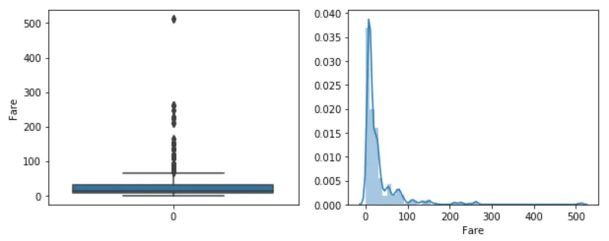

2. 类别变量分析

   * 无相对大小的类别变量，例如花瓣的形状、颜色
   * 有相对大小的类别变量，例如年龄分段

   关于单个类别变量的分析，需要重点观测其分布情况

   * 类别变量的 `nunique` 情况

   * 类别变量在数据集的占比分布（出现次数&占比）

     

   1. 基于数值观察

      直接使用 `pandas` 的 `nunique`, `value_counts` 等函数进行观察即可

   2. 可视化

      可以直接用 bar 图来进行观测

      在数据的 `nunique` 值非常大的时候，一般会选择摘取出现次数最多的 Top N 个数据进行观测
      
      ```python
      sns.countplot( x = 'Pclass', data = df)
      df['Pclass'].value_counts(normalize = True).plot(kind = 'bar')
      ```
      
      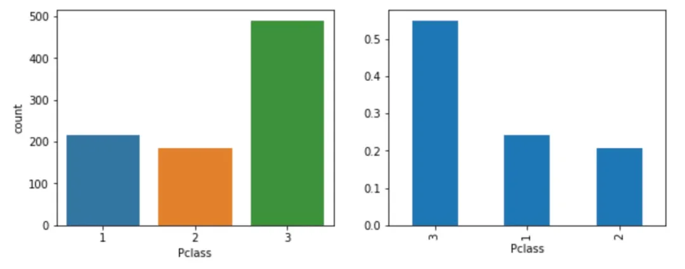

3. 时间变量分析

   关于时间类型的数据，需要重点观测下面的几点内容:

   * 数据在每个时间段的频次，可以当做类别变量分析；此处尤其需要注意一些突变的点，这些点一般都会存在某些特殊的信息

   因为时间变量的特殊性，存在非常多特殊的问题需要思考:

   * 拆分为 月/天/日/小时，然后当做类别变量进行观测
   * 抽取周期性信息，例如：工作日七天，然后观察周中和周末的分布信息

4. 字符串类型

   首先判断字符串是不是真正意义上的字符串类型

   * 当前的字符串数据是不是类型误标记了，它本质可能是其它类型的变量，例如时间类型的变量等等

   * 如果是简单的字符串，例如国家等信息，我们就可以将其作为无相对大小的类别变量进行分析

   * 文本类字符串: 需要特别分析

     1. `wordcloud` 可视化

        ```python
        from wordcloud import WordCloud, STOPWORDS, ImageColorGenerator  
        plt.figure(figsize = [10,8])
        
        text = 'I love dog dog dog, mikey. My brother likes dog too. But his brother likes cats.' 
        wordcloud = WordCloud().generate(text)  
        
        plt.imshow(wordcloud, interpolation='bilinear')
        plt.axis("off")
        plt.show() 
        ```

        
     
     2. `scattertext` 可视化
     
        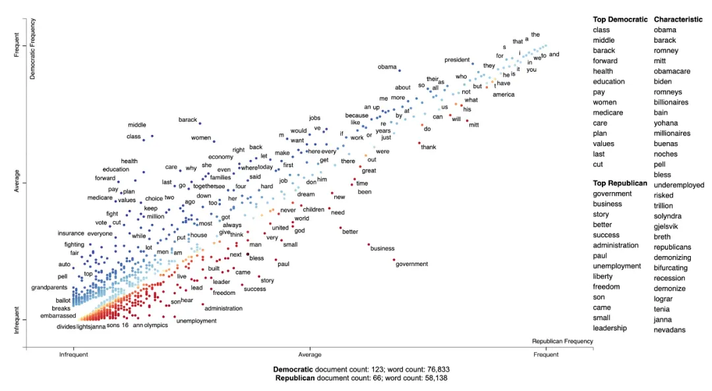

5. 图像数据

   `PIL`, `matplotlb.image`, `cv2`, `scipy`, `skimage` 等等

---

### 3.3 变量交叉分析

1. 标签为数值变量

   一般常见于回归相关的问题

   * 类别变量+数值标签

     关于类别变量与数值标签的关系，我们一般会观察下面的结果:

     1. 每个类别情况下对应的均值, 可以直接使用 `pandas` 进行绘制

        ```python
        df.groupby(var)[label].mean().plot(kind = 'bar')
        ```

        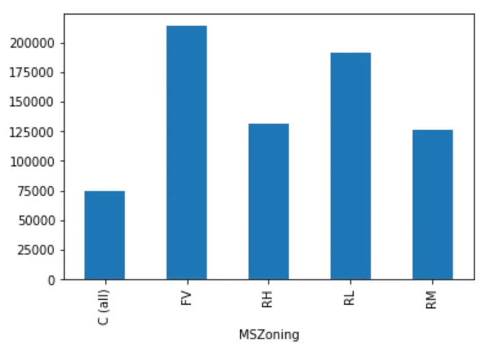

     2. 均值反映的信息并不十分详细，如果希望得到更加具体的分布，可以使用 `boxplot` 进行绘制

        ```python
        sns.boxplot(x=var, y=label, data=df)
        ```

        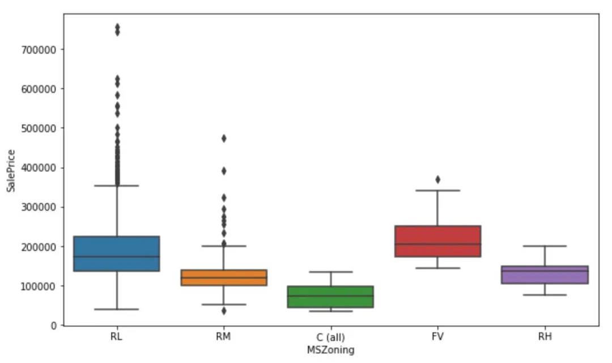

     如果不同类别之间的标签分布相差较大，则说明该类别信息是非常有有价值的，如果所有类别的标签都是一样的分布，则该类别信息的区分度相对较低

   * 数值变量+数值标签

     关于数值变量与数值标签的关系，我们一般会观察下面的结果:

     1. 数值特征与数值标签的 Pearson 相关系数。如果该数值的绝对值越大，往往说明该特征能为模型带来非常大的帮助
        
        ```python
        df[['LotArea',label]].corr('pearson')
        ```

        $$
        \rho_{X, Y}=\frac{\textrm{cov}(X, Y)}{\sigma_X\sigma_Y}
        $$
        
     2. 观察数值特征与数值标签的时候，一般采用散点图即可，也可以使用 `regplot` 绘制出拟合的曲线

        ```python
        plt.scatter(x='LotArea', y = label, data = df)
        ```

        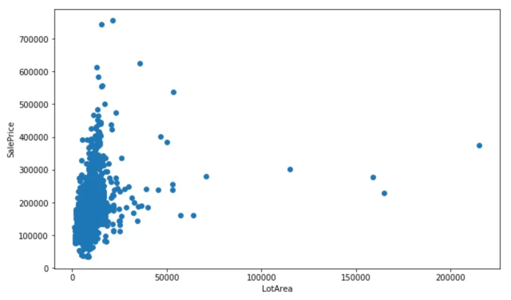

        ```python
        sns.regplot(x=df['LotArea'] , y=df[label])
        ```

        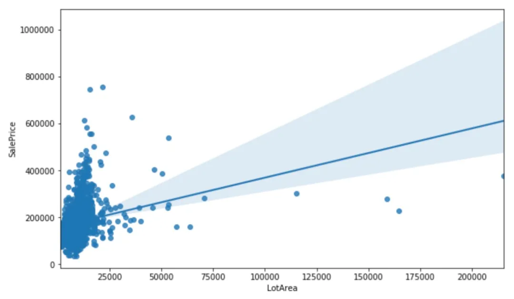

   * 时间变量+数值标签

     关于时间与数值标签，我们主要希望随着时间变化，数据是否表现除了某些特殊的模式（周期性等），以及是否出现了明显的异常现象等等。时间变量与数值变量的可视化直接使用 `plot` 函数即可
     
     * `plot`
     
       ```python
       # 用 index 模拟时间
       plt.plot(df.index, df[label].values, color='black', linestyle='--', linewidth='1', label=label)
       ```
     
       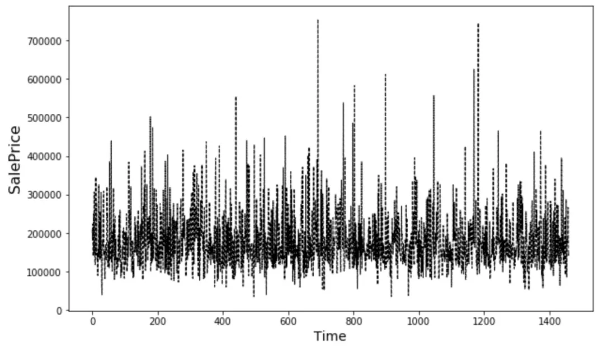
     
     * `statsmodels` 分解
     
       ```python
       from statsmodels.tsa.seasonal import seasonal_decompose
       decomposition = seasonal_decompose(self.ts, freq=freq, two_sided=False)
       self.trend = decomposition.trend
       self.seasonal = decomposition.seasonal
       self.residual = decomposition.resid
       decomposition.plot()
       plt.show()
       ```
     
       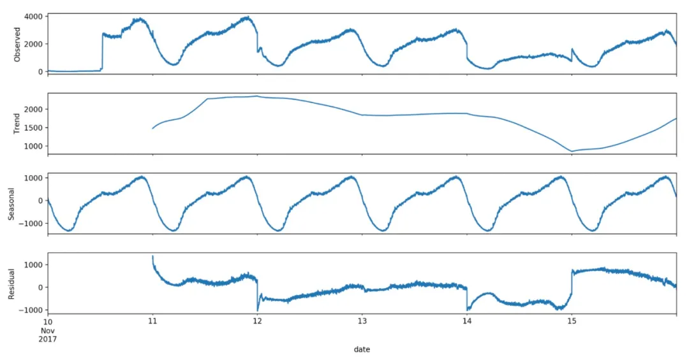

2. 标签为二元变量

   一般常见于二分类问题

   1. 类别变量+二元标签

      关于类别变量与二元标签的关系可以直接通过 `barplot` 函数进行可视化，如果不同类之间的分布差不大，那说明该类别变量大概率是意义不大的

      ```python
      sns.barplot(x=var, y=label, data=df)
      ```

      

   2. 数值变量+二元标签

      数值变量与二元标签的关系一般可以通过下面的两种方式分析:

      * 对数值变量进行分桶，然后基于类别变量与二元标签的关系进行分析
      
      * 使用 `boxplot` 函数，观测在不同标签下，数值特征的分布差异
      
        ```python
        sns.boxplot(df[label], df['Fare'])
        ```
      
        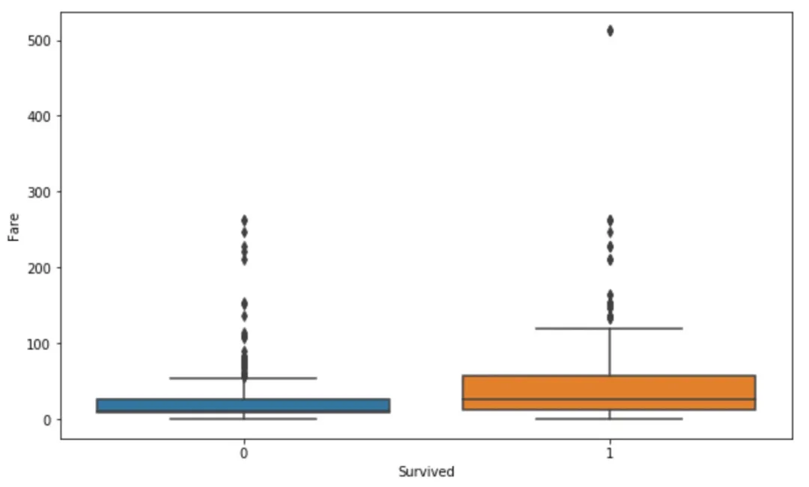

3. 标签为多元类别变量

   也就是常说的多分类问题。在观测标签为多分类的问题时，因为标签是多个类别的，可以通过两种策略对其进行观察

   * 将多分类转化为多个二分类然后进行观测，这么做最大的问题是分析量大大增加了，会使得问题变得更加繁琐
   * 采用和数值变量+二元标签的策略对模型进行观测

   1. 类别变量+N 元标签

      直接使用 `countplot`，将 `hue` 的位置设置为标签的名称即可

      ```python
      sns.countplot(x='Pclass', hue='label', data=df)
      ```

      

   2. 数值变量+N 元标签

      直接使用 `boxplot` 即可，观测在每个类处数值变量的分布情况。如果所有类处的数值变量分布都类似，那可能该数值变量带来的影响会相对较小，反之影响较大
   
      ```python
      sns.boxplot(x='label', y='Age', data=df)
      ```

---

### 3.4 训练集测试集分布不一致性

目前 90% 以上的数据竞赛都是会同时给出训练集和测试集数据，这种情况下，如果数据的分布不一致，那么模型的预估将大打折扣

1. 单变量数据分布不一致

   * 缺失值

     有些字段在训练集中都很正常，但是在测试集合中缺失极为严重，甚至 99% 以上的数据都缺失了。这种时候最简单的策略就是直接将训练集中的字段直接进行删除。这么做虽然线下的验证效果会变差，但是线上线下的效果会变得更为稳定
     
   * 数值特征分布

     于数值特征分布一致不一致最为简单和常用的方式就是直接绘制对应字段在训练集合和测试集合中的分布。例如可以直接使用 `seaborn` 中的 `distplot` 函数来绘制

     

     橘黄色的表示训练集某数值字段的分布, 蓝色表示测试集中对应字段的分布

     或者使用 KDE (Kernel Density Estimation), 一种非参数检验方法:

     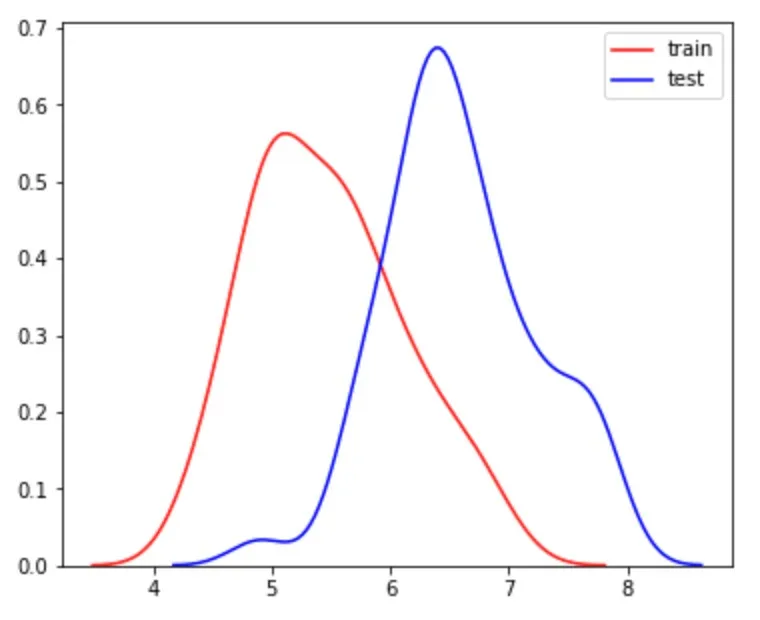

     从上面的分布来看，我们发现训练集和测试集的交集非常少，如果不是因为主办方数据划分时的问题，那么可能就需要研究产生这种情况的原因了

   * 类别特征分布

     1. 交集&占比情况

        类别特征在许多竞赛中也是出现次数最为频繁的，而关于类别特征，我们需要重点检查的就是训练集和测试集合中元素的差异。最需要检测的就是:

        * 在测试集合中的类别是否在训练集合中都存在？在测试集中出现的类别而未再训练集中出现的个数和比例是多少？
        * 在测试集中出现的类别而未在训练集中出现的比例是多少?（Overlap的比例）

     2. KL 散度

        KL 散度是用于衡量两个概率分布的匹配程度的指标，两个分布差异越大，KL散度越大
        $$
        KL(P||Q)=\sum_{x\in\mathcal X}P(x)\log\frac{P(x)}{Q(x)}
        $$
        $P, Q$ 是训练集和测试集的分布，定义在相同概率空间，直接计算每个类别的百分比即可

2. 多变量数据分布不一致

   * 多变量的衍生变量探索

     该方法和自己做特征类似，先对特征进行演化，常采用下面的策略:

     ```python
     tr.groupby(feature1)[feature2].agg(stas) 
     te.groupby(feature1)[feature2].agg(stas)
     ```

     然后基于演化之后的特征再进行细致的研究观察，此处可以直接使用单变量观测时候的技巧即可

   * 基于模型的对抗验证

     该方法是目前为止最为通用的策略，其思路也非常简单

     1. 将训练集的数据全部打标签为 1，将测试集的数据全部打标签为 0

     2. 将训练集和测试集的数据合并，然后进行 N 折交叉验证

     3. 如果交叉验证的 AUC 接近 0.5，那么说明训练集和测试集的分布是类似的；如果 AUC 非常大，例如大于 0.9，那么我们就认为训练集和测试集的分布是存在较大差异的

        

     * 基于模型寻找分布差异最大的特征

       通过训练好的模型，我们可以直接输出各个模型的特征重要性，排在最前面的特征就是造成训练集和测试集合分布不一致的重要因素。所以很容易的我们就找到了训练集和测试集合分布差异大的特征

     * 注意点

       虽然通过模型的方式我们得到了各个特征的重要性，但是要注意的是，这些特征仅仅只是训练集和测试集能分开的重要信息，此外并不能说明太多

       例如: 对训练集和测试集加入 index 信息

       ```python
       tr['index'] = list(range(tr.shape[0]))
       te['index'] = list(range(te.shape[0]) + tr.shape[0])
       ```

       这样我们就可以得到 AUC=1.0 的结果，但是我们也会发现加入这些到模型中其实线上和线下的 gap 很多时候并不是非常大，明明分布差异那么大，但是却影响不大。其实这个也很容易解释，如果该特征在真实训练的时候并不是强特征，而仅仅只是在对抗训练中是强特，这最终的影响其实就很小了。所以在很多时候，在遇到线上分数和线下验证分数严重不一致的时候，我们还需要判断模型训练中强特在对抗训练中的重要性:

       * 如果二者都很重要，那么大概率会出现不一致现象
       * 如果在目标模型训练中是弱特征，在对抗训练中是强特，那么不一定会出现线上线下不一致的现象

---

## 4 样本筛选与样本组织

### 4.1 样本筛选

为什么要进行样本的筛选：

* **提效**：删除异常错误的数据，噪音数据，提升数据的质量，使模型能更好的得到训练，拿到更好的效果
* **降本**：很多业务场景的数据量是巨大的，针对此类业务场景，数据的存储、模型的训练需要耗费大量的资源，样本筛选可以帮助我们节省更多的资源，使机器学习在这些场景的应用变得可能

哪些情况下需要对样本进行筛选：

* 剔除一些明显错误或者异常的数据，使我们模型可以得到更好的训练，从而获得更好的效果
* 剔除对于模型预测任务帮助不大甚至有害的数据（往往是特定情况下的噪音数据），使模型能朝着我们期望的方向得到更加充分的训练
* 一些可能收集错误的，或者误标记的样本，这些数据对模型造成困惑，删除能使模型能得到更好的训练
* 基于某些合理的假设，剔除一些可能没那么大用处的数据
* 因为标签分布不平衡等原因，对不同的样本进行筛选 (例如正负样本采样等) 操作，可以得到更好的效果
* 计算资源的限制，我们希望能找到最具有代表性的样本进行模型的训练，使我们能在有限的时间，计算资源的情况下拿到更好的效果

如何进行样本筛选：

* 明显异常的或者错误的数据

  直接删除

* 依据预测的任务进行样本的筛选

  在电商销量预测的问题中，我们需要预测某段普通时间某些店铺的日销量，此时如果我们在建模的过程中使用电商大促时间段的数据去预测平时的商品的销量，那么大概率就会出现非常大的误差，很难拿到我们期望的结果。而如果我们需要预测某些店铺在大促期间的销量，这就和上面的情况不一样了，大促期间店铺的销量情况在这个时候则非常具有参考价值，将大促期间的数据加入到模型中进行训练，效果往往会更加好一些

* 可能收集错误的或者误标记的样本

  例如我们再使用拼多多或者淘宝 app 进行购物时，因为手机本身相对较小，但手机页面中又会显示较多的商品，所以不可避免的就会出现误点击等情况，从而引入一些用户本身并不希望点击但是被误触而变成了点击的样本。又例如，很多时候我们并不会在点击了某个商品之后就直接进行购买，往往需要对比一段时间之后，可能是 1 个小时、也可能是多个小时、甚至是几天才会进行购买，这就带来了标签延迟的问题，而实践中，延迟的样本往往不是少数。这就不可避免的带来了很多错误的标签，把未来用户购买的样本标记为了负样本。如果能找到这些样本对其进行纠正或者删除，往往能带来不错的收益

  筛选方式:

  * 基于模型的策略

    1. 先对训练数据进行模型的训练 (例如典型的树模型等)，得到模型
    2. 使用在训练集上训练得到的模型对训练集进行预测
    3. 对预测结果进行特定的筛选 (一般会选择删除绝对误差最大的样本，至于删除的比例是一个超参数，可以自己调)

    **注意**: 在二分类问题中，我们发现删除训练集合上预测结果为 0.5 附近的样本，很多时候也可以带来部分的小提升，可能这部分样本是较难训练的，所以对其进行删除，反而有助于模型更好的训练

  * 基于某些假设的策略

    对数据进行某种形式的假设，然后把不满足假设的数据进行剔除等操作

    * 例1: 在推荐问题中，用户的点击是较大程度地受到曝光商品的位置影响，用户往往倾向于点击位置靠前的商品，而在很多商家的统计中，大家也发现，曝光前 10 的商品会占据所有曝光商品 70% 以上的点击，很多用户都不会去看曝光排名靠后的商品，也就是说，**用户基本没有对这些商品进行评估，自然也就不会去点击购买**。而如果我们直接将所有的样本全部当做是负样本处理，并不是最优的策略

      针对此类问题，很多算法工程师会选择记录用户最后一次点击样本的曝光位置，并将曝光位置大于该值的样本直接删除，或者将最后一次点击样本的位置加上某个值，把大于该值的样本直接进行剔除。这么做既可以减少训练样本的个数，而且有些时候也能取得更优的效果

    * 例2: 在销量预测问题中，为了数据的完整性，很多时候商家会直接给出历史五年的销量纪录，预测未来几天的销量。但是我们知道，用户在刚刚营业的时候往往会给出非常多的优惠活动，例如开业一周内，所有商品打五折等等。而且随着时间的变化，销量变化是非常大的，尤其是这种跨度较长的数据集中，几年前的数据可能对于当前的预测完全没有任何参考价值

      所以在对此类问题建模时：**我们经常会假设过早的数据的分布与当前差异较大，刚刚营业期间的数据也会带来误导等**，不使用过早的数据，同时将刚刚营业的数据剔除等

* 数据量与计算的平衡

  很多时候，我们需要对样本进行某种形式的筛选（有时也称之为采样），从而将时间存储等成本控制在可以接受的范围内

  1. 随机降采样

     * 保留所有的正样本
     * 从负样本中随机抽取一定比例的样本

     注意要先做特征然后再进行负样本的采样

  2. 时间序列采样

     所有涉及到时间相关的问题，例如推荐问题，电商搜索，销量预测，流量预测等问题在数据量足够大的时候，我们往往都会对其进行采样，保留最近 N 天的数据。按照时间戳进行采样，保留特定时间段以及之后的数据即可

---

### 4.2 样本组织

涉及到样本组织的问题最为常见的就是与时间序列建模相关的问题，例如各大电商或者视频网站的搜索与推荐等问题，商店的销量预测，股价的预测等

1. 基于最小单位的滑动建模

   什么是最小单位:

   * 如果预测问题是预测未来 N 天商店每一天的销量，那么最小单位就是**1天的销量**
   * 如果预测问题是预测未来 N 个月店铺每个月的销售额，那么最小单位就是**1个月的销售额**
   * 如果预测问题是预测未来 N 个小时每个小时的人流量，那么最小单位就是**1个小时的人流量**

   也就是说把给定的问题划分为了 N 个小问题，这样每次建模的时候就仅仅只需要拿出最小单位的数据来当做标签。例如，预测未来N天的每一天的销量，下面每个小的圆圈表示一天的情况，预测未来第二天的销量的时候，样本的组织形式就可以按照下面的形式进行：

   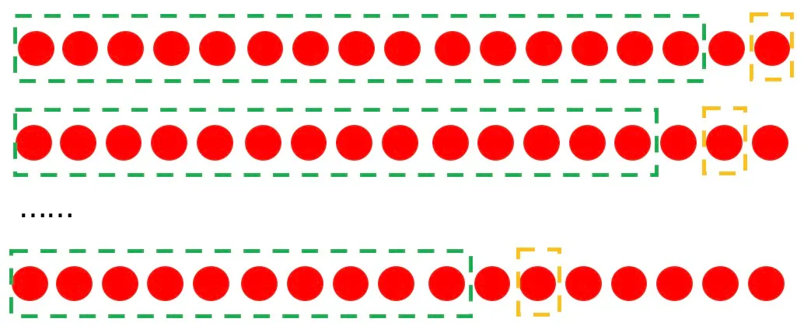

   * 使用第 N 天的数据作为标签，使用 1 到 N-2 天的数据进行特征的构建
   * 使用第 N-1 天的数据作为标签，使用 1 到 N-3 天的数据进行特征的构建
   * 使用第 N-2 天的数据作为标签，使用 1 到 N-4 天的数据进行特征的构建
   * ......

   这种建模是非常通用的，基本所有的问题都可以按此类方式进行建模。但需要构建多个模型进行训练和预测，非常耗时

2. 基于测试组的滑动建模

   什么是测试组:

   * 如果预测问题是预测未来 N 天商店每一天的销量，那么测试组就是**N天商店每一天的销量**
   * 如果预测问题是预测未来 N 个月店铺每个月的销售额，那么测试组就是**N个月的每个月销售额**
   * 如果预测问题是预测未来 N 个小时每个小时的人流量，那么测试组就是**N个小时每个小时人流量**

   和基于最小单位的滑动建模不同，我们把给定的问题划分为了一个问题，如下图所示，我们预测未来3天的每一天的销量，下面每个小的圆圈表示一天的情况，在预测未来第 N+1 到第 N+3 天的每一天销量的时候，样本的组织形式就可以按照下面的形式进行：

   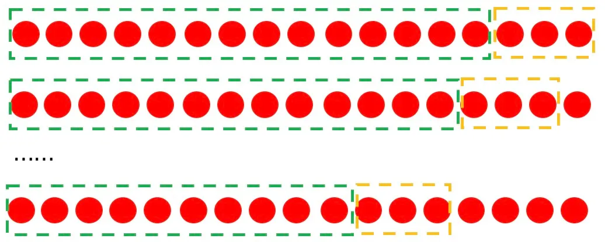

   * 使用第 N-2, N-1, N 天的数据作为标签，使用 1 到 N-3 天的数据进行特征的构建
   * 使用第 N-3, N-2, N-1 天的数据作为标签，使用 1 到 N-4 天的数据进行特征的构建
   * 使用第 N-4, N-3, N-2 天的数据作为标签，使用 1 到 N-5 天的数据进行特征的构建
   * ......

   这种样本组织的方式会更为通用一些，但是每次训练的样本会成倍变多，所以需要耗费更多的存储资源

3. 基于周期形式的建模

   上面两种形式的建模都忽略了周期性，比如预测的是本周三到下周三每天商店的销量，而在使用上面的方式进行样本组织的时候则往往会很随意的将某个周四到下个周四的数据当做标签去训练，这么做在预测的时候会带来较差的效果，尤其是在数据集的周期性较为显著的情况下

   如下图所示，预测未来一周中每一天的销量，下面每个小的圆圈表示一天的情况，预测未来第 N+1 到第 N+7 天的每一天销量的时候，样本的组织形式就可以按照下面的形式进行

   

   * 使用第 N-6, N-5, ..., N 天的数据作为标签，使用 1 到 N-7 天的数据进行特征的构建
   * 使用第 N-13, N-12, ..., N-7 天的数据作为标签，使用 1 到 N-14 天的数据进行特征的构建
   * 使用第 N-20, N-19, ..., N-14 天的数据作为标签，使用 1 到 N-21 天的数据进行特征的构建
   * ......

   这种建模可以很好地考数据集合中存在的周期性，在过往的诸多竞赛中也都取得了不俗的效果，比上面的两种策略都要好出很多

4. 注意事项

   90% 左右的获奖方案都可以划分为上面介绍的三种形式中的某一种或者几种的组合

   1. 一定要考虑周期性。例如预测未来一周每个小时的地铁流量，那么建模的时候最好是做好标签的对应，预测星期三早上 8 点的地铁流量，那么建模的时候将每周三早上 8 点的数据作为标签

   2. 尽可能不浪费数据：有的时候我们的任务是预测未来 8 天的销量，那么建模的时候我们会习惯性地以 7 天为一个周期进行建模，有的时候我们发现训练集最后 6 天的数据无法形成一个周期，这个时候就会将这些数据丢弃，这么做就浪费了数据，这个时候可以将最后 6 天也作为标签，不需要追求完整的一周数据

      为什么 7 天周期？？

   3. 未来数据也并不是全都不可以获取：样本组织的时候，我们都习惯性地尽可能不考虑未来的数据，但诸如星期，节假日等信息都是非常明确的，还有距离当前的时间等信息都非常有价值

---

## 5 验证策略设计

验证集设计的合理与否，对于整个竞赛都会带来非常大的影响，如果我们的模型线下验证结果和线上的结果不一致，将会导致无法继续进行后续的实验。此处所说的不一致，指的是线下结果有一定幅度的提升，但线上却下降了的情况；如果线下提升幅度不是非常大，但是线上下降了可能是因为波动的原因，可以认为是合理的

### 5.1 训练集验证集分割验证

1. 随机划分

   随机的训练集验证集切分是最为简单也是最为常见的验证策略

   1. 将训练集合按照一定比例随机切分为新的训练集和验证集
   2. 我们使用新的验证集进行训练并在验证集上进行验

   简单的训练集和验证集划分策略目前经常会出现在一些**数据集较大的问题同时时间因素影响不大的情况下**，因为数据集较大的原因，验证一次的时间消耗较大，同时我们认为较大数据集的验证结果是相对可靠的，所以简单的训练集和验证集的划分就可以满足

   * 如果训练集合非常大，比如有上亿条记录，采用 80：20 的比例进行划分即可；当然 70：30 和 90：10 也都是可以的
   * 如果我们的训练集合一般，比如只有20000条数据，那么采用 70：30 左右的比例进行划分会较为合适，尽可能往验证集上多划分一些数据，不过这个时候最好使用 K 折交叉验证

2. 分层划分

   分层划分主要常见于分类问题，有些分类问题的每个类标签的示例数并不均衡。分层划分的步骤和随机的类似，最好将数据集拆分为训练集和验证集，以便在每个类中保留与在原始数据集中观察到的差不多比例的样本。

   1. 将训练集合按照一定比例**分层**划分为新的训练集和验证集
   2. 我们使用新的训练集进行训练并在验证集上进行验证

### 5.2 K折交叉验证

1. 随机K折交叉验证

   简单的随机划分或者单次分层划分在我们数据集非常大，验证一次需要耗费较大量的计算代价和时间成本的时候较为常用。但是当我们的数据集并不是非常大时候，验证一次的成本也没有那么高的时候，为了保证模型的验证是靠谱的，最为常见的就是 K 折交叉验证

   1. 对数据集进行 shuffle 打乱顺序
   2. 将数据分成 K 折。K=5 或 10 适用于大多数情况
   3. 保留一折用于验证，使用剩下的其它折数据进行模型的训练
   4. 在训练集合上训练模型，在验证集上评估模型，并记录该 fold 的结果
   5. 现在对所有其它的 fold 重复该过程，每次选择单折作为验证的数据集
   6. 对于每一次迭代，我们的模型都会在不同的数据集上进行训练和测试
   7. 最后我们将每一次的分数相加，采用最终的平均分作为我们的验证结果

   K 折交叉验证在很多的数据竞赛中都是非常常见的，当数据量并不是非常大，验证一次的时间代价也相对较小，同时数据集受时间等影响也非常小的时候，就考虑采用 K 折交叉验证。从实践经验中，我们也发现：K 折交叉验证不仅可以给我们带来一个更加靠谱的线下效果，与此同时，通过 K 折验证可以得到 K 个训练好的模型，采用 K 个模型分别对测试集进行预测并取均值或者中位数等作为最终预测结果带来的预测效果往往也会更好更稳定

2. 分层 K 折交叉验证

   简单的 K 折验证是最为常见的策略，但和随机划分处介绍的一样，我们希望每折中都可以有准确的数据分布

   * 在回归问题的情况下：我使每折中的平均值大致相等
   * 在分类问题的情况下：每折具有相同比例的分类标签

   分层 K 折在分类问题中更有用，在分类问题中，每折中具有相同百分比的标签非常重要

3. 分组K折交叉验证

   随机 K 折交叉验证以及基于分层的 K 折验证已经适用于90%的时序影响较小的问题，但仍然存在一些问题。例如，如果训练集和测试集是不同组的内容，此处**组**指的是需要预测的问题的主体，例如：

   * 训练集合是关于10万用户的历史逾期贷款记录（每个月产出一条记录），我们需要预测另外1万个**未出现**在训练集合中的用户对应的记录是否会出现逾期贷款的问题

   分组 K 折验证的步骤可以分为：

   1. 判定需要进行分组的 ID
   2. 基于分组的 ID 进行随机 K 折验证

   分组的 K 折交叉验证常常被用于判断基于某个特定组的数据训练得到的模型是否具有很好的泛化性，能够在未见过的组上取得很好的效果。

   * 如果测试集和训练集合中的组存在较大的差异，这个时候对这些测试集数据采用分组训练预测往往能带来更加稳定的效果
   * 如果测试集和训练集合中的组存在的差异较小，简单的 K 折交叉验证即可

4. 分层分组K折交叉验证

5. Repeated K 折交叉验证

   因为把样本随机分为 K 个不重叠的折，所以K 折交叉验证会出现这种现象：

   * 相同的特征，相同的 K 折验证，不同的随机种子，两次的验证结果分数相差不小

   于是就有了Repeated K 折交叉验证：

   1. 设置重复的验证的次数 M
   2. 对于每一次验证，我们选用不同的随机种子进行 K 折验证
   3. 将 M 次的验证结果取均值作为最终的验证结果

   注意：此处**必须在同一数据集上执行 K 折交叉验证**，在每次重复中，同一个数据集被拆分为不同折

   Repeated K 折交叉验证可以很好地提升模型预估结果的置信度，一般常常使用在那些**数据集相对不是非常大的情况下**。因为模型每次验证消耗的时间相对较短，计算资源的消耗也相对较小。和 K 折交叉验证类似，Repeated K 折交叉验证很容易并行化，其中每折或每个重复交叉验证过程可以在不同的内核或不同的机器上执行

6. Nested K折交叉验证

   在使用 K 折验证方案的时候经常会基于某一折进行调参，所以每一折的验证结果都是在特定条件下相对最优的，产生了轻微的过拟合

   Nested K 折交叉验证将模型的超参调优作为模型的一部分，为了防止模型过拟合的问题，不再直接在验证的那一折上进行调参等操作：

   1. 基于特定的问题，我们数据集进行特定的K折划分(随机/分层/分组...): $D_1, D_2,\dots,D_K$
   2. 在第 L 轮中，选用 $D_L$ 为验证集，其它折的数据集进行拼接得到新的训练集合
   3. 基于新的训练集合，采用 $K_{inner}$ 折交叉进行超参数的调优，基于最优的参数重新训练得到模型
   4. 使用重新训练得到的模型对验证集进行预测，然后进行评估

   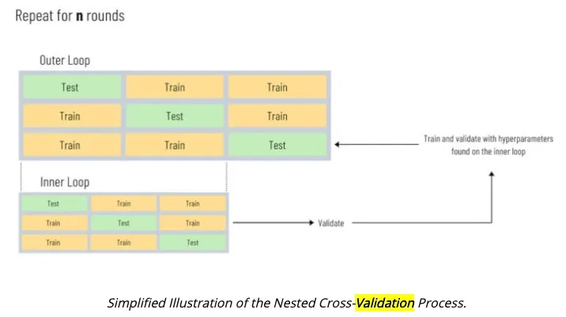

### 5.3 基于时间序列的验证

上面的所讲述的训练集验证集的划分策略以及 K 折交叉验证在时间影响较小的情况下是非常合适的，但是在很多时间影响较大的问题中，例如：

* 商家店铺销量预测
* 用户视频观看时长预测问题
* 网页流量预测

这些问题如果直接使用传统的验证策略，往往会造成很严重的穿越问题，使得线下线上波动极大，因为时间序列相关的数据观测值之间的相关性是紧靠时间的（自相关的）。经典的交叉验证技术都是假设样本是独立同分布的，并且会导致时间序列数据上的训练和测试实例之间不合理的相关性（产生较差的泛化误差估计）。

1. 单折时间划分

   在时间相关的问题中，最常见的验证策略就是按照时间信息进行排序，然后选取某个时间点之后的数据集作为验证集合，前面的数据作为训练集合

   1. 按照时间信息对我们的数据集进行排序
   2. 选取某个相对时间/绝对时间作为划分点，之前的作为训练集合，之后的数据作为验证集合

   

2. 基于时间的 N 折验证

   在销量预测问题中，很多公司会有促销之类的活动，所以模型只选择一天进行验证就会出现不稳定的情况，但是在实践中发现，如果连续 N 天的验证都是有提升的，那么大概率该模型上线之后也能带来较为稳定的提升。其步骤也较为简单：

   1. 选用 T+1 天的数据作为验证集，1,2,...,T 的数据进行模型的训练
   2. 选用 T 天的数据作为验证集，1,2,...,T-1 的数据进行模型的训练
   3. 选用 T-1 天的数据作为验证集，1,2,...,T-2 的数据进行模型的训练
   4. ......

   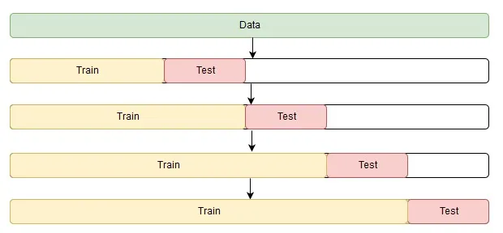

## 6 模型理解、选择

在数据类问题的建模中，该选用何种模型进行建模是困扰所有参赛选手的问题之一。幸运的是，在过往的十来年的数据挖掘竞赛中，大家尝试了大量的机器学习算法，发现：

* 传统的表格 (Tabular) 类模型，基于梯度提升树的模型往往可以取得更好的成绩，我们对这些历史竞赛进行了统计，发现对于表格型的数据算法竞赛，超过90%以上的获奖方案目前都都是基于梯度提升树模型的。目前有些特定的领域，例如推荐，销量预测等问题慢慢地神经网络也展露头角
* 图像，NLP，序列化等非 Tabular 类的模型，Top 的方案主要基于各种神经网络的；虽然早期也会有一些传统方案的，例如随机森林等，但是最近几年已经全部演化为了神经网络相关的模型

### 6.1 GBDT

1. CART (Classification and Regression Tree)

   CART本质是对特征空间进行二元划分 (即 CART 生成的决策树是一棵二叉树), 它能够对类别变量与连续变量进行分裂，其分割的核心思想是先对某一维数据进行排序 (这也是需要对无序的类别变量进行编码的原因) , 然后对已经排好后的特征进行切分, 切分的方法就是 if ... else ... 的格式. 然后计算衡量指标(分类树用 Gini 指数,回归树用最小平方值), 最终通过指标的计算确定最后的划分点, 然后按照下面的规则生成左右子树:

   If x < A then go left; else go right.

   * 分裂指标（分类树：Gini 指数）

     对于给定的样本集 $D$ 的 Gini 指数: 分类问题中, 假设有 $K$ 个类, 样本点属于第 $k$ 类的概率为 $p_k$, 则概率分布的基尼指数为
     $$
     Gini(D)=\sum_{k=1}^K p_k(1-p_k)
     $$
     从 Gini 指数的数学形式中，我们可以很容易的发现，当 $p_1=p_2=\cdots=p_k$ 的时候 Gini 指数是最大的，这个时候分到每个类的概率是一样的，判别性极低，对分类带来的帮助很小，可以忽略

     当某些 $p_i$ 较大，即第 $i$ 类的概率较大，此时我们的 Gini 指数会变小意味着判别性较高，样本中的类别不平衡

     在给定特征 $A$ 的条件下, 样本集合 $D$ 的基尼指数(在 CART 中)为:
     $$
     Gini(D, A)=p_1Gini(D_1)+p_2Gini(D_2)\\p_i=\frac{|D_i|}{|D_1|+|D_2|},i\in\{1, 2\}
     $$
     在 CART 分割时，按照 **Gini 指数最小**来确定分割点的位置

     例:
   
     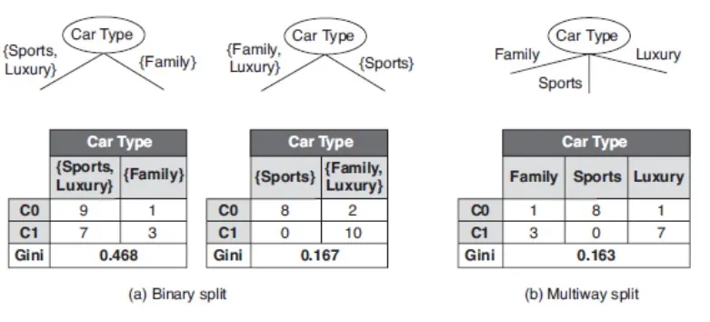
   
     $Gini(D, CarType)=\frac{9+7}{9+7+1+3}[\frac{9}{9+7}(1-\frac{9}{9+7})+\frac{7}{9+7}(1-\frac{7}{9+7})]+\frac{1+3}{9+7+1+3}[\frac{1}{1+3}(1-\frac{1}{1+3})+\frac{3}{1+3}(1-\frac{3}{1+3})]=0.468$
   
   * CART 分类树, 无剪枝
   
     输入: 训练数据集 D, 停止计算条件
     输出: CART 决策树
   
     根据训练数据集,从根节点开始,递归地对每个结点进行以下操作,构建二叉决策树：
   
     1. 设结点的训练数据集为 $D$, 计算现有特征对该数据集的基尼指数, 此时, 对每一个特征, 对其可能取的每个值 $a$ (先排序), 根据样本点对的测试"是"或"否"将 $D$ 分割成 $D_1,D_2$, 计算当 $A=a$ 时的基尼指数
     2. 在所有可能的特征 $A$ 以及它们所有可能的切分点中, 选择基尼指数最小的特征及其对应的切分点作为最优特征与最优切分点, 依最优特征与最优切分点, 从现节点生成两个子节点, 将训练数据集依特征分配到两个子节点中去
     3. 对两个子节点递归调用 1 和 2, 直至满足停止条件
     4. 生成CART决策树
   
   * CART 回归树
   
     输入: 训练数据集 D, 停止计算条件
     输出: CART 回归树 $f(x)$
   
     在训练数据集所在的输入空间中, 递归地将每个区域划分为两个子区域并决定每个子区域的输出值, 构建二叉决策树：
   
     1. 选择最优切分变量 $j$ 与切分点 $S$, 求解:
        $$
        \min_{j,s}[\min_{c_1}\sum_{x_i\in R_1(j, s)}(y_i-c_1)^2+\min_{c_2}\sum_{x_i\in R_2(j, s)}(y_i-c_2)^2]
        $$
        遍历变量 $j$, 对固定的切分变量 $j$ 扫描切分点 $s$, 选择使得上式达到最小值的 $(j,s)$
   
     2. 用选定的对 $(j,s)$ 划分区域并决定相应的输出值：
        $$
        R_1(j, s)=\{x|x^{(j)}\leqslant s \}, R_2(j, s)=\{x|x^{(j)}> s \}\\ \bar c_m=\frac {1}{N_m}\sum_{x_i\in R_m(j, s)}y_i, x\in R_m, m\in \{1, 2\}
        $$
        
     3. 继续对两个子区域调用 1 和 2,直至满足停止条件
     
     4. 将输入空间划分为 $M$ 个区域 $R_1, R_2,\dots,R_m$, 生成决策树: $f(x)=\sum_{m-1}^M\bar c_mI(x\in R_m)$
     
     CART的建模是基于单特征的，没有考虑特征之间的关联性，但这也给了我们两个提示
     
     * 特征是不需要进行归一化处理的
     * 有时需要通过特征之间的相关性来构建新的特征
   
2. Boosting

   **Boosting**: a machine learning ensemble meta-algorithm for primarily reducing bias, and also variance in supervised learning, and a family of machine learning algorithms which convert weak learners to strong ones

   多个弱分类器 $f_1(x), f_2(x),\dots,f_M(x)$

   将多个弱分类器转化为一个强分类器，最简单的方式是线性加权
   $$
   F(x)=\sum_{i=1}^M\alpha_if_i(x)=\sum_{i=1}^Mg_i(x)
   $$
   $\alpha_i$ 为第 $i$ 个分类器的权重

3. Boosting Tree

   将Boosting的思想和树模型结合，就得到了我们提升树的简易版本
   $$
   F(x)=\sum_{i=1}^Mg_i(x)=\sum_{i=1}^Mg(x, \theta_i)
   $$
   $g(x, \theta_i)$ 表示第 $i$ 棵树，$\theta_i$ 是第 $i$ 棵树的参数

   * Boosting的基本思想
   
     和大多数监督机器学习算法的目标一样，我们希望能够训练得到一个函数 $F(x)$，使得对于任意给定的输入变量 $x$，$F(x)$都能较好地近似 $y$。换言之，就是希望我们的损失函数 $Loss(y, F(x))$ 尽可能的小
   
     如果从传统的平方损失函数优化的角度出发就是: 对于所有的样本 $\min\frac 1N\sum_{i=1}^N(y_i-F(x_i))^2$, 写成向量的形式就是 $\min\frac 1N(y-F(x))^2$。因为 $F(x)$ 是由多个含有不同参数的弱分类器组成的，无法像传统的梯度下降那样进行直接的优化，所以采用对残差进行优化的方式进行求解
   
     目标是优化 $\min(y-F(x))^2$, $y$ 是向量的形式, 包含所有样本的 label
   
     1. 构造 $f_1(x)$，使得 $(y-f_1(x))^2$ 尽可能小
     2. 训练 $f_2(x)$，使得 $(y-f_1(x)-f_2(x))^2$ 尽可能小
     3. 训练 $f_3(x)$，使得 $(y-f_1(x)-f_2(x)-f_3(x))^2$ 尽可能小
     4. 以此类推，直至 $f_M(x)$
   
     从上面的构造角度看，我们发现构建第 $t+1$ 个分类器的时候，前 $t$ 个分类器已经被固定了，也就是说在第 $t+1$ 步，目标是 $\min(y-\sum_{j=1}^tf_j(x)-f_{t+1}(x))^2$。令 $r=y-\sum_{j=1}^tf_j(x)$ 表示残差，则下一个分类器 $f_{t+1}(x)$ 就是尽可能拟合残差 $r$，使得
     $$
     (y-\sum_{j=1}^tf_j(x)-f_{t+1}(x))^2=(r-f_{t+1}(x))^2<r^2
     $$
     这样每次迭代一轮，损失误差就会不断变小，在训练集上离目标也就更加近了
   
   * 提升树算法 (回归问题)
   
     **输入**: 训练数据集 $T=\{(x_1, y_1),(x_2, y_2),\dots,(x_N, y_N) \}, x_i\in X, y_i\in Y$
     **输出**: 提升树 $F_M(x)$
   
     1. 初始化 $f_0(x)=0$
     2. 对 $m=1,2,\dots,M$
        1. 计算残差 $r_{mi}=y_i-F_{m-1}(x_i), i=1,2,\dots,N$
        2. 拟合残差 $r_{mi}$ 学习一个回归树，得到 $f_m(x)$
        3. 更新 $F_m(x)=F_{m-1}(x)+f_m(x)$
     3. 得到提升树 $F_M(x)=\sum_{i=1}^Mf_i(x)$
   
4. Gradient Boosting

   目标是最小化 $L(y, F(x))$, 所以需要 $L(y, \sum_{j=1}^tf_j(x)+f_{t+1}(x))$ 比 $L(y, \sum_{j=1}^tf_j(x))$ 尽可能小

   此处假设损失函数 $L$ 可导，于是目标就是最大化 $L(y, \sum_{j=1}^tf_j(x))-L(y, \sum_{j=1}^tf_j(x)+f_{t+1}(x))$

   令 $c=\sum_{j=1}^tf_j(x)$，则原式为 $L(y, c)-L(y, c+f_{t+1}(x))$

   根据导数定义:
   $$
   L(c+f_{t+1}(x))\approx L(c)+L'(c)f_{t+1}(x)
   $$
   若 $f_{t+1}(x)=-L'(x)$，则
   $$
   L(c+f_{t+1}(x))=L(c)-L'(c)^2<L(c)
   $$
   ??????????????????????????????

   所以我们用 $f_{i+1}(x)$ 来拟合 $f_{t+1}(x)=-L'(x)$, 原先的 $r$ 就变成了现在的梯度

   啥啊这都是，i 又是个啥

   * 梯度提升树算法

     **输入**: 训练数据集 $T=\{(x_1, y_1),(x_2, y_2),\dots,(x_N, y_N) \}, x_i\in R^n, y_i\in R$, 损失函数 $L$, 树的个数 $M$
     **输出**: 梯度提升树 $F_M(x)$

     1. 初始化 $f_0(x)=\textrm{argmin}_c\sum_{i=1}^NL(y_i, c)$
     2. 对 $m=1,2,\dots,M$
        1. 对 $i=1,2,\dots,N$ 计算 $r_{mi}=-[\frac{\partial L(y_i, f(x_i))}{\partial f(x_i)}]_{f(x)=F_{m-1}(x)}$
        2. 拟合残差 $r_{mi}$ 学习一个回归树，得到 $f_m(x)$
        3. 更新 $F_m(x)=F_{m-1}(x)+f_m(x)$
     3. 得到提升树 $F_M(x)=\sum_{i=0}^Mf_i(x)$

     上面提到的梯度提升树是最简易的版本，后续写在各种开源包中的GBDT都在残差的部分增加了步长 (或者学习率)：
     $$
     r_{mi}=-\alpha_m[\frac{\partial L(y_i, f(x_i))}{\partial f(x_i)}]_{f(x)=F_{m-1}(x)}
     $$
     用学习率来控制模型的学习速度，和传统的梯度下降的方式类似

---

### 6.2 XGBoost

XGBoost 中的 GBDT 与传统的 GBDT 在算法层面有主要有两处较大的不同:

1. XGBoost中的导数引入了二阶导数部分
2. XGBoost中的剪枝部分在对叶子的个数做惩罚的同时还加入权重的惩罚，也就是说，正则项进行了改进

---

### 6.3 LightGBM


---

### 6.4 CatBoost


---

## 7 特征工程

### 7.1 为什么要特征工程

在模型学习不好的地方或者难以学习的地方，采用特征工程的方式帮助其学习，通过人为筛选、人为构建组合特征让模型原本很难学好的东西可以更加容易地进行学习、进而拿到更好的效果

本节针对梯度提升树模型进行探讨

1. 梯度提升树数据吸收方式

   树模型每次分裂的时候都会贪心地寻找一个最佳的分割点，依据寻找到的最佳分割点将数据一分为二。然后再从所有的特征中继续贪心地寻找下一个分割点，继续以最佳分割点位中心，按照大于小于该值的情况进行分割，依此类推

   也就是说，梯度提升树模型可以近似认为是一种贪心的二叉树模型

2. 梯度提升树的问题

   从梯度提升树模型对于数据的吸收方式中，发现梯度提升树对于下面几种情况做得不够好

   * 高基数类别数据

     一个类别特征中不同的值的个数较大的时候，我们认为该类别特征是高基数的特征

     当类别特征的基数较大，树模型很难在较短的几次分裂过程中将数据完美的分割开。树模型是基于贪心的策略，只要其中有一次分割的位置不好，那么对于后续的分割就会产生一些不良的影响，这也是为什么很多梯度提升树模型在碰到高基数的类别特征的时候效果效果不佳

   * 交叉信息挖掘

     交叉信息就是特征之间的交叉关系，举例来说，用户 ID 是单个特征，商店 ID 也是单个特征，那么用户和商品的组合就是二阶组合特征。因为梯度提升树模型每次都只会对单个特征进行分割，进而再对下一个特征进行分割，所以如果两个特征的交叉存在极强的信息，那么梯度提升树模型是很难挖掘出此类信息的

     例：有一些交易数据，区分用户是不是好用户

     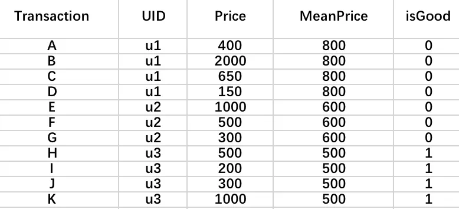

     如果使用 Price 进行分割，发现没法直接分割开，从而会出现下面这种的分割情况:

     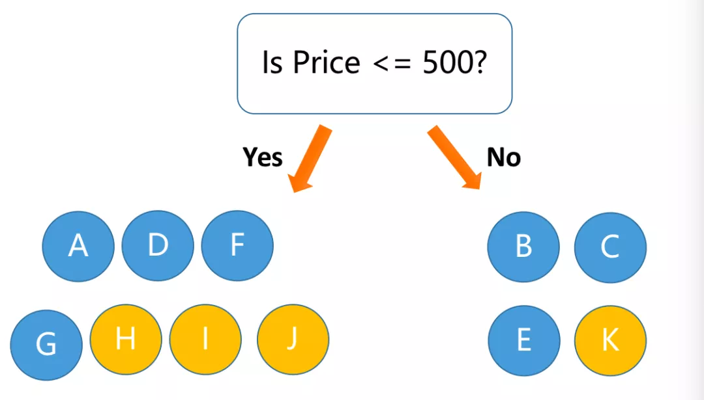

     而如果基于用户 ID 和用户消费的价格求均值，再进行分割，就可以很快地将二者完美的分割开

     

     也就是说，直接基于用户的 ID 对用户的消费价格求均值得到的特征帮助了模型

   * 局部上下文信息特征

     梯度提升树模型每次都是贪心的按照大于，小于等于某个值进行分割，而如果该特征上下之间存在某些关系，同时这些关系影响非常大的话，梯度提升树模型也是极难捕捉到的。例如在某个波动曲线中，如果下一时刻与上一时刻的差值大于某个阈值，这个时候表示出了故障，而其它时候则正常，这种情况梯度提升树模型可能完全不知道该如何去区分

     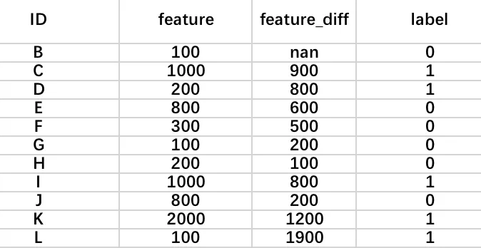

     如果按照原始的 feature 进行划分：

     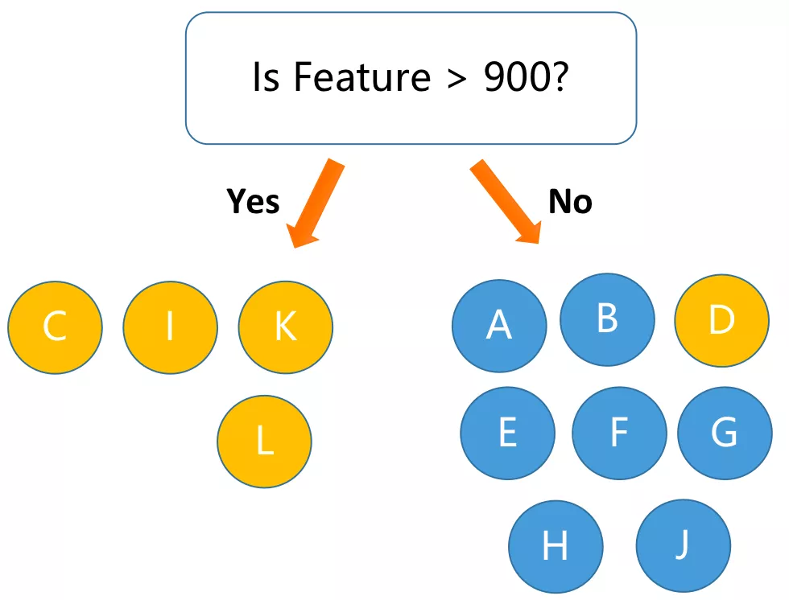

     对于剩下的 200 那个却极难划分。而如果进行上下文的特征抽取，即用下一阶段的值减去上一阶段的值并取绝对值，那么就可以得到下面所示的结果

     

---

### 7.2 单类别变量特征工程

* Label编码

  无序的类别变量，在很多时候是以字符串形式的出现的，例如：

  * 颜色：红色，绿色，黑色...
  * 形状：三角形，正方形，圆形...

  梯度提升树模型是无法对此类特征进行处理的。直接将其输入到模型就会报错。而这个时候最为常见的就是使用 `LabelEncoder` 对其进行编码。`LabelEncoder` 可以将类型为 `object` 的变量转变为数值形式，例子如下

  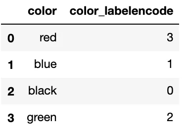

  `LabelEncoder` 默认会先将 `object` 类型的变量进行排序, 然后按照大小顺序进行的编码, 此处 N 为该特征中不同变量的个数。几乎所有的赛题中都会这么做，这样做就可以将转化后的特征输入到模型，虽然这并不是模型最喜欢的形式，但是至少也可以吸收10%左右的信息，总比直接丢弃该变量的信息好很多

* One-Hot 编码

  对于一个类别特征变量，对每个类别，使用二进制编码（0或1）创建一个新列（有时称为 dummy 变量），以表示特定行是否属于该类别。One-Hot 编码可以将一个基数为 M 的类别变量转变为 M 个二元向量。以上面的颜色为案例，进行 One-Hot 编码之后就得到:

  

  One-Hot 编码将数据展开之后内存的消耗变得非常大，因为使用 One-Hot 编码时需要创建额外的列，为需要编码的特征列中的每个每个唯一值创建一个列。也就是说，如果有包含 10000 个不同值的类别特征，那么在 One-Hot 编码之后将会生成 10000 个额外的新的列，这是不可以接受的

  但它的好处也非常明显，One-Hot编码之后，我们的线性模型可以更好的吸收 High-Cardinality 的类别信息

  那么对于 XGBoost，LightGBM 之类的树模型是否有必要呢？答案是有的！在我们的实践中，很多时候对高基数的类别特征直接进行 One-Hot 编码的效果往往可能不如直接 `LabelEncoder` 来的好。但是当类别变量中有一些变量是人为构造的，加入了很多噪音，这个时候将其展开，那么模型可以更加快的找到那些非构建的类别，取得更好的效果

* Frequency 编码

  Frequency 编码是数据竞赛中使用最为广泛的技术，在 90% 以上的数据建模的问题中都可以带来提升。因为在很多的时候，频率的信息与目标变量往往有一定关联，例如：

  * 在音乐推荐问题中，对于乐曲进行 Frequency 编码可以反映该乐曲的热度，而热度高的乐曲往往更受大家的欢迎
  * 在购物推荐问题中，对于商品进行 Frequency 编码可以反映该商品的热度，而热度高的商品大家也更乐于购买
  * 微软设备被攻击概率问题中，预测设备受攻击的概率，那么设备安装的软件是非常重要的信息，此时安装软件的 count 编码可以反映该软件的流行度，越流行的产品的受众越多，那么黑客往往会倾向对此类产品进行攻击，这样黑客往往可以获得更多的利益

  Frequency 编码通过计算特征变量中每个值的出现次数来表示该特征的信息，例如：

  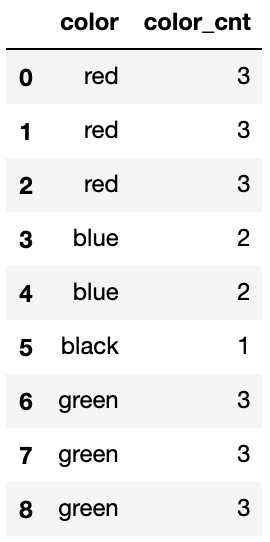

* Target 编码

  Target 编码是 06 年提出的一种结合标签进行编码的技术，它将类别特征替换为从标签衍生而来的特征，在类别特征为高基数的时候非常有效。该技术在非常多的数据竞赛中都取得了非常好的效果，但特别需要注意过拟合的问题。

  1. Leave-one-out mean-target 编码

     Leave-one-out mean-target编码的思路相对简单，每次编码时，不考虑当前样本的情况，用其它样本对应的标签的均值作为编码，而测试集则用全部训练集样本的均值进行编码，案例如下：

     

  2. K-fold mean-target 编码

     K-fold mean-target 编码的基本思想来源于 Mean target 编码。K-fold mean-target 编码的训练步骤如下，先将训练集划分为 K 折

     * 在对第 A 折的样本进行编码时，我们删除 K 折中 A 折，并用剩余的数据计算如下公式
       $$
       label_c=\frac{p_cn_c+p_{global}\cdot\alpha}{n_c}
       $$
       
     * 后利用上面计算得到的值对第 A 折进行编码
     * 依次对所有折进行编码
     
     最原始的 Mean-target 编码是非常容易导致过拟合的，这其中过拟合的最大的原因之一在于对于一些特征列中出现次数很少的值过拟合了，比如某些值只有 1 个或者 2 到 3 个，但是这些样本对应的标签全部是 1，怎么办，他们的编码值就应该是 1，但是很明显这些值的统计意义不大。而如果我们直接给他们编码了，就会误导模型的学习。所以需要加正则，于是我们就有了上面的计算式子，$n_c$ 是值 $c$ 出现的次数, $p_c$ 是它对应的概率，$p_{global}$ 是全局的均值, 那么当 $\alpha$ 为 0 同时 $n_c$ 比较小的时候， 就会有大概率出现过拟合的现象，此时我们调大就可以缓解这一点，所以很多时候都需要不断地去调整 $\alpha$ 的值
     
  3. Beta Target 编码
  
     * Beta Target Encoding 可以提取更多的特征，不仅仅是均值，还可以是方差等等
     * 在开源中，是没有进行 N Fold提取特征的，所以可能在时间上提取会更快一些
  
     Beta Target 编码利用 Beta 分布作为共轭先验，对二元目标变量进行建模。Beta 分布用 $\alpha,\beta$ 来参数化，$\alpha,\beta$ 可以被当作是重复 Binomial 实验中的正例数和负例数
  
     Beta Target Encoding 适用于高基数类别特征的问题
  
  4. Weight of evidence
  
     Weight of evidence (WOE) 是变量转化的利器，经常会出现在信用卡评分等问题中，用来判断好的和坏的客户。WOE 不仅简单，而且可以依据其大小来筛选出重要的分组（group），可解释性较强，早期 WOE 和逻辑回归算法经常一起使用并且可以帮助获得较大的提升，WOE 和梯度提升树模型结合也可以取得不错的效果
     $$
     WOE=\ln\frac{Event\%}{Non-Event\%}=\ln\frac{Pos\ Distribution}{Neg\ Distribution}
     $$
  
     * 此处的Event 和 Non Event 分别是标签为 1 的样本的分布以及标签为 0 的样本的分布
     * 标签为 1 的样本分布: 在某个类内正样本占所有正样本的比例；标签为 0 的样本分布也是类似的
  
     正样本的分布和负样本的分布如果在某个类中差别越大的话，涵盖的信息就越大，如果 WOE 的值越大，该这个类内的为正的概率极大，反之越小
  
     在实践中，可以直接通过下面的步骤计算得到 WOE
  
     * 对于一个连续变量可以将数据先进行分箱，对于类别变量无需做任何操作
     * 计算每个类内（group）中正样本和负样本出现的次数
     * 计算每个类内（group）正样本和负样本的百分比 events% 以及 non-events%
     * 按照公式计算 WOE
  
* 人工编码

  1. 人工转化编码

     这个需要一些专业背景知识，可以认为是Label编码的一种补充，如果类别特征是字符串类型的，例如：

     * 城市编号：'10', '100', '90', '888'...

     这个时候，`Labelencoder` 会依据字符串排序编码。在字符串中 '90' > '100'，但我们直观感觉是为 '100' > '90'，所以需要人为进行干预编码，如果都是可以直接转化为数值形的，编码时可以直接转化为数值，或者自己书写一个字典进行映射。

  2. 人工组合编码

     这个同样的也设计到部分专业背景知识，有些问题会出现一些脏乱的数据，例如：

     * 在一些位置字段中，有的是中文的，有的是英文的，例如“Shanghai”，“上海”，二者描述的是同一个地方，但如果我们不注意就忽略了

     这个时候，我们可以先采用字典映射等方式对其进行转化，然后再使用上面所属的Frequency 等编码重新对其进行处理

---

### 7.3 有序类别变量 & 单数值变量特征工程

有序类别特征就是有相对顺序的类别特征。例如：

* 年龄段特征：1-10, 11-20, 21-30, 31-40 等年龄段
* 评分特征：high, medium, low

有序类别特征和无序的类别特征有些许区别，例如 Label 编码等，如果我们直接按照原先的 `LabelEncoder` 进行转化就会丢失特征相对大小的信息，这对于梯度提升树模型会带来负向的效果，因为序列信息可能和标签有着强烈的相关性

* Label编码 -> 字典编码
* One-Hot编码 -> 很少用
* Frequency，Target，WOE，人工编码使用方式不变

1. 有序字典编码

   有序字典编码，就是将特征中的每个字段按照相对大小构建字典，再进行转化。如下所示，假设：'high' > 'medium' > 'low'，然后再进行映射

   |      | ratings | traditional encode |      |
   | :--- | :------ | :----------------- | ---- |
   | 0    | high    | 0                  | 2    |
   | 1    | medium  | 2                  | 1    |
   | 2    | low     | 1                  | 0    |

   从上面简单的例子中，可以看出：

   * 无序类别特征的编码打乱了原始的内在顺序关系，可能增大梯度提升树模型训练的难度，而有序字典编码的方式则最大程度的保留了所有的信息

2. 分段编码

   分段聚类编码也是一种分箱的策略，它主要基于数据的相对大小并结合业务背景知识对类别特征进行分段分组重新编码。例如，现在需要预测学生的幸福指数，有一个类别特征：

   * **学籍特征**：小学一年级，小学二年级，小学三年级，小学四年级，小学五年级，小学六年级，初中一年级，初中二年级，初中三年级，高中一年级，高中二年级，高中三年级，大学一年级，大学二年级，大学三年级，大学四年级

   我们发现**学籍特征**是存在相对顺序的，也就是我们的有序类别特征；与此同时，我们知道，小学初中高中大学这几个阶段幸福的阶段都不一样，比如小学可能是小学一年级最不开心，因为刚刚从幼儿园到一年级不适应造成；而小学初中高中大学在最后一个学年都会很不开心，因为那个时候压力最大，面临着人生的重要转折。所以这个时候，需要对特征进行分段编码，将学籍编码为小学，初中，高中，大学。还可以将各个不同阶段按照年级的大小进行分段，分为该阶段的高年级生，低年级生和中间年级的学生。

   |      | student status | traditional encode | self defined encode | student status 1st | student status 2nd |
   | :--- | :------------- | :----------------- | :------------------ | :----------------- | ------------------ |
   | 0    | 小学一年级     | 7                  | 0                   | 0                  | 0                  |
   | 1    | 小学二年级     | 9                  | 1                   | 0                  | 0                  |
   | 2    | 小学三年级     | 8                  | 2                   | 0                  | 1                  |
   | 3    | 小学四年级     | 12                 | 3                   | 0                  | 1                  |
   | 4    | 小学五年级     | 10                 | 4                   | 0                  | 2                  |
   | 5    | 小学六年级     | 11                 | 5                   | 0                  | 2                  |
   | 6    | 初中一年级     | 0                  | 6                   | 1                  | 0                  |
   | 7    | 初中二年级     | 2                  | 7                   | 1                  | 1                  |
   | 8    | 初中三年级     | 1                  | 8                   | 1                  | 2                  |
   | 9    | 高中一年级     | 13                 | 9                   | 2                  | 0                  |
   | 10   | 高中二年级     | 15                 | 10                  | 2                  | 1                  |
   | 11   | 高中三年级     | 14                 | 11                  | 2                  | 2                  |
   | 12   | 大学一年级     | 3                  | 12                  | 3                  | 0                  |
   | 13   | 大学二年级     | 5                  | 13                  | 3                  | 1                  |
   | 14   | 大学三年级     | 4                  | 14                  | 3                  | 1                  |
   | 15   | 大学四年级     | 6                  | 15                  | 3                  | 2                  |

   通过对学籍的转化，梯度提升树模型往往可以得到更好的效果。但这种特征很多时候需要有一定的业务背景才能挖掘到

   分段编码这种方式在数据竞赛中还是非常常见的，例如我们可以：

   * 将 24 小时分别编码为：上午，下午，晚上
   * 将每个月分为月初，月中，月末等等

   基于转化之后的特征再与其它特征进行组合特征往往还能获得更多的提升

有序类别特征在编码之后可以认为是数值特征的一种特例。所以有序类别特征转化之后所采用的各种编码技巧，在数值特征同样适用，例如 Frequency 编码也可以在数值特征处适用，而且很有意义

比如说用户消费，对用户的消费进行 Frequency 编码，发现某些数值的出现的次数特别多，例如 100 出现多次，该信息可能反映的就是用户经常去消费某类商品，这在没有其它额外辅助信息的情况是非常有帮助的

1. 小数点之后的数值

   很多数值特征是带有小数点的，而小数点之后的位数有些时候也能反映诸多信息，例如我们有:

   * 数值特征：10.12,10.123,10.02,10.2,10.222,10.45,100,10.23,......

   这个时候，小数点之后的长度可能就潜藏一些有意思的信息，对其长度进行统计则非常有意义

   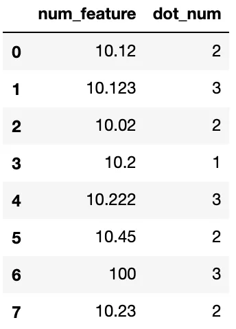

2. 特殊数字

   举个非常典型的案例，就是使用微信红包、微信转账等信息预测二人关系，比如 520，1314 等红包

   关于这些特殊数字的统计信息就能很好地反映此类信息，可以单独做个二元特征来表示该笔转账是否为特殊转账

   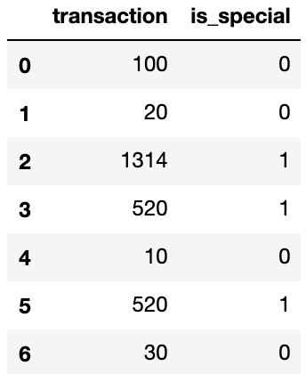

3. 数值符号

   其实数值的符号一般就两个，"+" 和 "-"，最常见的就是银行卡里面的支出和收入

   * \+ 的次数就是收入的次数；- 的次数就是支出的次数

   这些信息一般在和用户的 ID 等特征进行组合使用，发挥的价值可能会更大，这样就可以得到用户的支出次数和收入的次数等

---

### 7.4 单时间变量特征工程

时间信息是极其敏感的信息，我们在数据竞赛中看到分数前后排出现较大 gap 的时候，第一时间需要考虑的就是时间信息，时间特征在很多竞赛中，往往可以决定排名的走势，那么当我们拿到时间相关的特征时，该如何进行思考，构建强有力的特征呢

1. 基础周期特征 (年月日特征拆解)

   几乎所有的时间都可以被拆解为年-月-日-小时-分钟-秒-毫秒的形式。在大多数情况中，拆解之后的数据往往存在某些潜在规律的，比如：

   * 对某个城市的旅游人数进行预估，旅游是存在旺季和淡季的，这个时候拆分之后得到的月份就非常重要
   * 预估店铺每天的销量，因为很多公司都会在月末发工资，这个时候拆解得到的天信息就会比较重要
   * 预估用户是否会下单，那么小时特征可能就比较重要，比如这个时候已经是晚上 11 点了，用户在搜索旅馆的信息，那么大概率可能就会下单，相反如果是中午在搜索，那么该用户可能并不是很急，所以下单的概率就会小一些
   * 预估地铁的每个小时的流量，那么早上 7 点到 8 点，晚上 5 点到 7 点，这些上下班的高峰期，流量一般就会大一些

   虽然拆解很简单，但是里面会按含有非常多的潜在重要信息，如果直接对时间信息进行 Label 编码，然后使用梯度提升树模型进行训练预测，是极难挖掘到此类信息的，但是拆解之后却可以极大的帮助到梯度提升树模型发现此类信息

   |      | date       | year | month | day  |
   | :--- | :--------- | :--- | :---- | ---- |
   | 0    | 2020-07-03 | 2020 | 7     | 3    |
   | 1    | 2020-08-09 | 2020 | 8     | 9    |
   | 2    | 2020-08-29 | 2020 | 8     | 29   |
   | 3    | 2020-08-19 | 2020 | 8     | 19   |

2. 特殊周期特征 (星期 & 节假日等)

   * 星期特征

     * 我们需要预测某些餐馆的人流量，那么热闹的大餐馆周六周日的人流量就会比平时多一些；而一些靠近互联网大公司附近的商场可能周末人会少很多，因为平时工作日忙，就会在附近商场吃饭，但是到了周日了，不用上班了，周围的人流量大大下降，反而使得商场附近餐馆的人流量大大下降了

   * 月和星期组合特征

     有些时候，我们还会将星期特征和月份特征结合，构成简单的组合特征

     * 我们需要预测某些餐馆的销售额，一般公司会在月末发放工资，所以每个月的最后一个周末的餐馆的销售额可能就会比平常的周末大一些

   * 节假日特征

     节假日这个不仅包含国家的法定节假日，依据问题的不同，还有非常多特殊的日期，例如：

     * 如果我们的问题是预测各大电商的日GMV，那么每年的双 11 等特殊日期就尤为重要
     * 如果我们的问题是预测旅游景点的客流量，那么五一、十一等节假日的日期就尤为重要

   * 节假日和星期组合特征

     节假日和星期的组合也是非常强的组合特征，在有些问题中，又是重要节日又是周末会是非常强的信息，在另外一些问题中，节假日如果是连着周六周日的，那么这些信息也都是非常重要的组合特征，因为这意味着假期可能延长了，所以会是一种较强的信号

3. 月份暗含信息

   该特征经常适用于关于以月为单位的预估问题，例如预估某个公司每个月的产值，某个景点的旅游人数，这个时候每个月中工作日的天数以及休假的天数就是非常重要的信息

4. 时间差

   * 相邻时间差

     相邻两个时间戳之间的差值。在有些问题中，例如用户浏览每个视频的开始时间戳，相邻两个时间戳的差值一般就是用户浏览视频的差值，如果差值越大，那么该用户可能对上一个视频的喜好程度往往越大，此时，相邻时间戳的就是非常有价值的特征

   * 相邻时间差频率编码

     关于相邻特征差值的频率编码，该特征往往适合相邻时间差互补的一个特征，可以帮助我们更好地挖掘一些内在的信息。例如有些自律的用户在会控制自己的休息与工作的时长，我们在统计用户的生活习惯时，发现大量的相邻时间差为 10 分钟和 60 分钟的，原来是该用户喜欢工作 60 分钟就休息 10 分钟，此时相邻时间差频率编码就可以协助我们发现此类信息。

